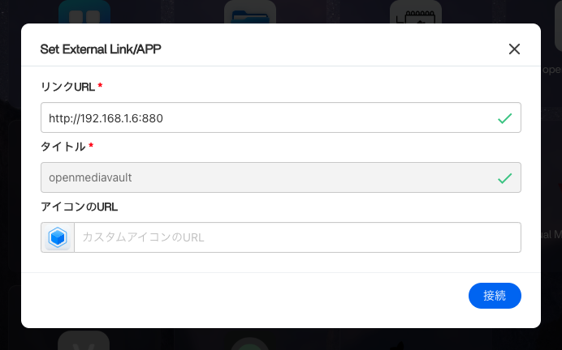

# CasaOS Custom Icons by taikun114
**English** | [日本語](docs/README-ja.md)

This is a repository of custom icons for use with [CasaOS](https://casaos.io/).

They are few icons as they are mainly made for my use, but if you want to have an icon added, please open an Issue and I will make it and add it.

## How to use
Each icons are contained in [`/icons/`](/icons/). To use an icons, you will need to copy the link first.

### Step 1. Get a link of icon
First, find and open the icon you want to use from [`/icons/`](/icons/).

Next, get a link of the image. A link can be gotten in the following two ways.
- Right click on the image and select `Copy image address`
  - The image will be copied in the format `https://github.com/taikun114/CasaOS-Custom-Icons-by-taikun114/blob/main/icons/App-Name/App-Name.png?raw=true`.
- Right click on the image and select `Open image in new tab`, then copy the URL in the tab opened
  - The image will be copied in the format `https://raw.githubusercontent.com/taikun114/CasaOS-Custom-Icons-by-taikun114/refs/heads/main/icons/App-Name/App-Name.png`.

Both links you can get are different, but the result is the same. Copy the link using your preferred method.

### Step 2. Set the icon in CasaOS
#### Apps to be installed from now on
You can set custom icons when installing apps.

Open the detail page of the app you want to install from the store, hover over the arrow to the right of `Install` and click on `Custom Install`.

When the `Manual App Install` window opens, paste the link you just copied into the `Icon URL` section and click `Install` to complete the process.

#### Already installed apps
You can change custom icons for installed apps.

In the upper right corner of the app whose icon you want to change, click `... ` to open the menu and click `Settings`.

When the app settings window opens, paste the link you just copied into the `Icon URL` section and click `Save` to complete the process.

#### External links to be added from now on
You can set custom icons when adding external links.

Click `+` in the upper right corner of the app list to open the menu, then click `Add external link`.

When the `Add external link` window opens, paste the link you just copied into the `Icon URL` section and click `Connect` to complete the process.

#### Already added external links
You can change custom icons for added external links.

In the upper right corner of the external link whose icon you want to change, click `... ` to open the menu and click `Settings`.

When the `Set External Link/APP` window opens, paste the link you just copied into the `Icon URL` section and click `Connect` to complete the process.

