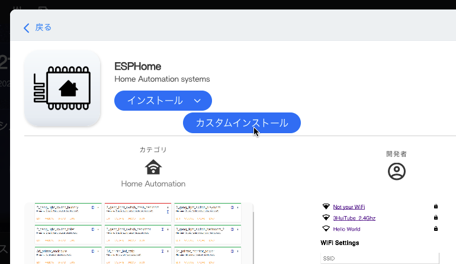
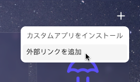
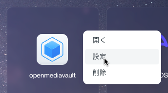

# CasaOS カスタムアイコン by taikun114
[English](/README.md) | **日本語**

[CasaOS](https://casaos.io/)で使うためのカスタムアイコンをまとめたリポジトリです。

主に私が使うために作ったものなので数は少ないですが、追加してほしいアイコンがある場合、Issueを開いていただければ作って追加します（1つのアイコンごとに1つのIssueを開いてください。複数のアイコンを追加してほしい場合、そのアイコンの数だけIssueを開く必要があります）。

## 使い方
各アイコンは[`/icons/`](/icons/)に含まれています。アイコンを使うには、最初にリンクをコピーする必要があります。

### 手順1. アイコンのリンクを取得する
まずは、使いたいアイコンを[`/icons/`](/icons/)から探して開きます。

次に、画像のリンクを取得します。リンクは次の2つの方法で取得することができます。
- 画像を右クリックして`画像アドレスをコピー`を選択する
  - `https://github.com/taikun114/CasaOS-Custom-Icons-by-taikun114/blob/main/icons/アプリ名/アプリ名.png?raw=true`の形式でコピーされます。
- 画像を右クリックして`新しいタブで画像を開く`を選択し、開いたタブのURLをコピーする
  - `https://raw.githubusercontent.com/taikun114/CasaOS-Custom-Icons-by-taikun114/refs/heads/main/icons/アプリ名/アプリ名.png`の形式でコピーされます。

取得できるリンクはどちらも異なりますが、結果は同じです。お好みの方法でリンクをコピーしてください。

### 手順2. CasaOSでアイコンを設定する
#### これからインストールするアプリ
アプリをインストールするときにカスタムアイコンを設定することができます。

ストアからインストールしたいアプリの詳細画面を開いたら、`インストール`の右側にある矢印にカーソルを合わせ、`カスタムインストール`をクリックします。

`アプリを手動でインストール`の画面が開いたら、`アイコンのURL`のところに、先ほどコピーしたリンクを貼り付けて`インストール`をクリックすれば完了です。

#### すでにインストール済みのアプリ
インストールされているアプリのカスタムアイコンを変更することができます。

アイコンを変更したいアプリの右上にある`...`をクリックしてメニューを開き、`設定`をクリックします。

アプリの設定画面が開いたら、`アイコンのURL`のところに、先ほどコピーしたリンクを貼り付けて`保存`をクリックすれば完了です。

#### これから追加する外部リンク
外部リンクを追加するときにカスタムアイコンを設定することができます。

アプリ一覧の右上にある`+`をクリックしてメニューを開き、`外部リンクを追加`をクリックします。

`外部リンクを追加`の画面が開いたら、`アイコンのURL`のところに、先ほどコピーしたリンクを貼り付けて`接続`をクリックすれば完了です。

#### すでに追加した外部リンク
追加した外部リンクのカスタムアイコンを変更することができます。

アイコンを変更したい外部リンクの右上にある`...`をクリックしてメニューを開き、`設定`をクリックします。

`Set External Link/APP`の画面が開いたら、`アイコンのURL`のところに、先ほどコピーしたリンクを貼り付けて`接続`をクリックすれば完了です。

